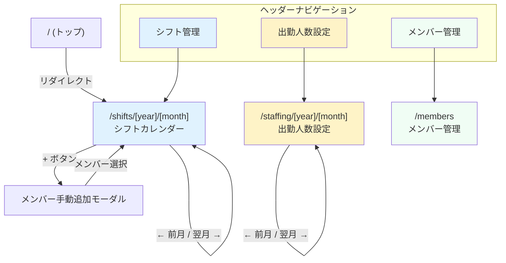

# 画面遷移図

```mermaid
graph TD
    ROOT["/ (トップ)"] -->|リダイレクト| SHIFTS

    subgraph NAV["ヘッダーナビゲーション"]
        NAV_SHIFT["シフト管理"]
        NAV_STAFFING["出勤人数設定"]
        NAV_MEMBERS["メンバー管理"]
    end

    NAV_SHIFT --> SHIFTS
    NAV_STAFFING --> STAFFING
    NAV_MEMBERS --> MEMBERS

    SHIFTS["/shifts/[year]/[month]<br/>シフトカレンダー"]
    STAFFING["/staffing/[year]/[month]<br/>出勤人数設定"]
    MEMBERS["/members<br/>メンバー管理"]

    SHIFTS -->|← 前月 / 翌月 →| SHIFTS
    STAFFING -->|← 前月 / 翌月 →| STAFFING

    SHIFTS -->|+ ボタン| PICKER["メンバー手動追加モーダル"]
    PICKER -->|メンバー選択| SHIFTS

    style NAV_SHIFT fill:#e0f2fe
    style NAV_STAFFING fill:#fef3c7
    style NAV_MEMBERS fill:#f0fdf4
    style SHIFTS fill:#e0f2fe
    style STAFFING fill:#fef3c7
    style MEMBERS fill:#f0fdf4
```
