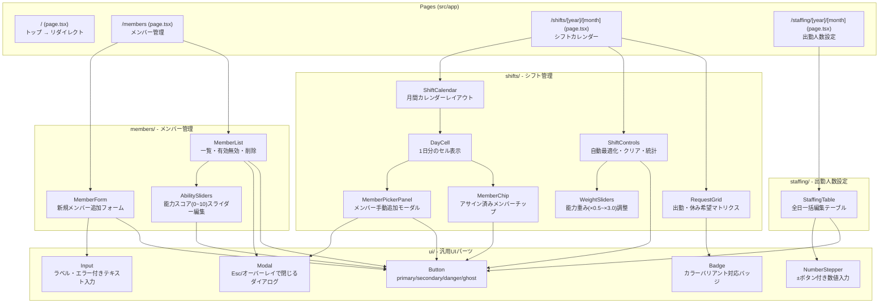

# コンポーネント構成図

```mermaid
graph TD
    subgraph Pages["Pages (src/app)"]
        P_HOME["/ (page.tsx)<br/>トップ → リダイレクト"]
        P_MEMBERS["/members (page.tsx)<br/>メンバー管理"]
        P_SHIFTS["/shifts/[year]/[month] (page.tsx)<br/>シフトカレンダー"]
        P_STAFFING["/staffing/[year]/[month] (page.tsx)<br/>出勤人数設定"]
    end

    subgraph UI["ui/ - 汎用UIパーツ"]
        Badge["Badge<br/>カラーバリアント対応バッジ"]
        Button["Button<br/>primary/secondary/danger/ghost"]
        Input["Input<br/>ラベル・エラー付きテキスト入力"]
        Modal["Modal<br/>Esc/オーバーレイで閉じるダイアログ"]
        NumberStepper["NumberStepper<br/>±ボタン付き数値入力"]
    end

    subgraph Members["members/ - メンバー管理"]
        MemberForm["MemberForm<br/>新規メンバー追加フォーム"]
        MemberList["MemberList<br/>一覧・有効無効・削除"]
        AbilitySliders["AbilitySliders<br/>能力スコア(0~10)スライダー編集"]
    end

    subgraph Shifts["shifts/ - シフト管理"]
        ShiftCalendar["ShiftCalendar<br/>月間カレンダーレイアウト"]
        ShiftControls["ShiftControls<br/>自動最適化・クリア・統計"]
        WeightSliders["WeightSliders<br/>能力重み(×0.5~×3.0)調整"]
        DayCell["DayCell<br/>1日分のセル表示"]
        MemberChip["MemberChip<br/>アサイン済みメンバーチップ"]
        MemberPickerPanel["MemberPickerPanel<br/>メンバー手動追加モーダル"]
        RequestGrid["RequestGrid<br/>出勤・休み希望マトリクス"]
    end

    subgraph Staffing["staffing/ - 出勤人数設定"]
        StaffingTable["StaffingTable<br/>全日一括編集テーブル"]
    end

    %% Page -> Component relationships
    P_MEMBERS --> MemberForm
    P_MEMBERS --> MemberList
    P_SHIFTS --> ShiftCalendar
    P_SHIFTS --> ShiftControls
    P_SHIFTS --> RequestGrid
    P_STAFFING --> StaffingTable

    %% Component hierarchy
    MemberList --> AbilitySliders
    MemberList --> Modal
    MemberList --> Button
    MemberForm --> Input
    MemberForm --> Button
    AbilitySliders --> Button

    ShiftControls --> WeightSliders
    ShiftControls --> Button
    ShiftCalendar --> DayCell
    DayCell --> MemberPickerPanel
    DayCell --> MemberChip
    MemberPickerPanel --> Modal
    MemberPickerPanel --> Button
    MemberChip --> Button
    RequestGrid --> Badge

    StaffingTable --> NumberStepper
    StaffingTable --> Button
```
