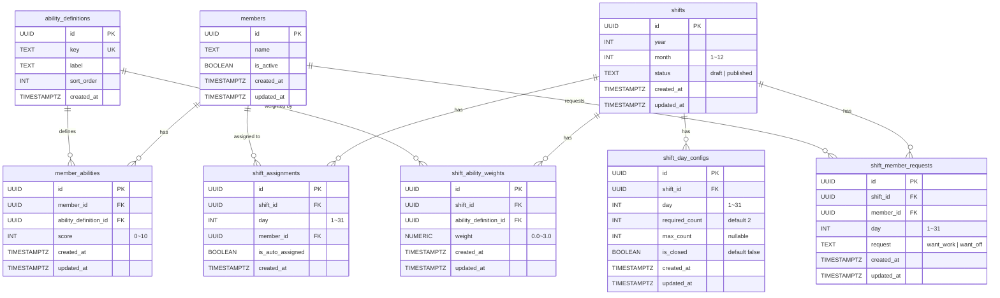

# ER図

```mermaid
erDiagram
    ability_definitions {
        UUID id PK
        TEXT key UK
        TEXT label
        INT sort_order
        TIMESTAMPTZ created_at
    }

    members {
        UUID id PK
        TEXT name
        BOOLEAN is_active
        TIMESTAMPTZ created_at
        TIMESTAMPTZ updated_at
    }

    member_abilities {
        UUID id PK
        UUID member_id FK
        UUID ability_definition_id FK
        INT score "0~10"
        TIMESTAMPTZ created_at
        TIMESTAMPTZ updated_at
    }

    shifts {
        UUID id PK
        INT year
        INT month "1~12"
        TEXT status "draft | published"
        TIMESTAMPTZ created_at
        TIMESTAMPTZ updated_at
    }

    shift_day_configs {
        UUID id PK
        UUID shift_id FK
        INT day "1~31"
        INT required_count "default 2"
        INT max_count "nullable"
        BOOLEAN is_closed "default false"
        TIMESTAMPTZ created_at
        TIMESTAMPTZ updated_at
    }

    shift_assignments {
        UUID id PK
        UUID shift_id FK
        INT day "1~31"
        UUID member_id FK
        BOOLEAN is_auto_assigned
        TIMESTAMPTZ created_at
    }

    shift_member_requests {
        UUID id PK
        UUID shift_id FK
        UUID member_id FK
        INT day "1~31"
        TEXT request "want_work | want_off"
        TIMESTAMPTZ created_at
        TIMESTAMPTZ updated_at
    }

    shift_ability_weights {
        UUID id PK
        UUID shift_id FK
        UUID ability_definition_id FK
        NUMERIC weight "0.0~3.0"
        TIMESTAMPTZ created_at
        TIMESTAMPTZ updated_at
    }

    members ||--o{ member_abilities : "has"
    ability_definitions ||--o{ member_abilities : "defines"
    shifts ||--o{ shift_day_configs : "has"
    shifts ||--o{ shift_assignments : "has"
    members ||--o{ shift_assignments : "assigned to"
    shifts ||--o{ shift_member_requests : "has"
    members ||--o{ shift_member_requests : "requests"
    shifts ||--o{ shift_ability_weights : "has"
    ability_definitions ||--o{ shift_ability_weights : "weighted by"
```
