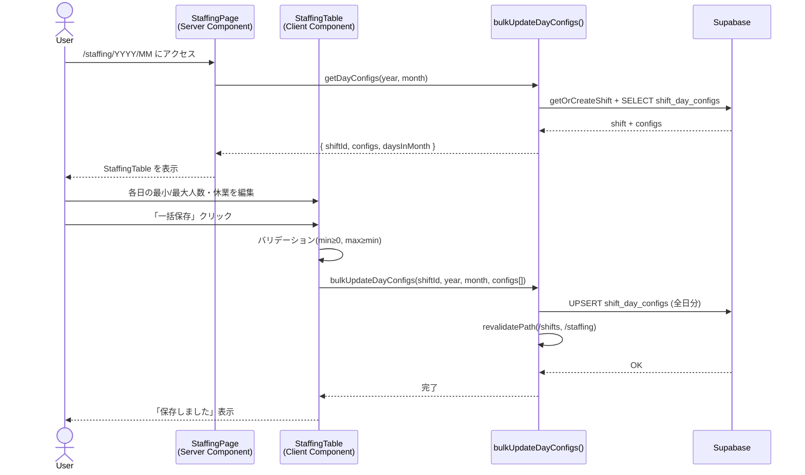
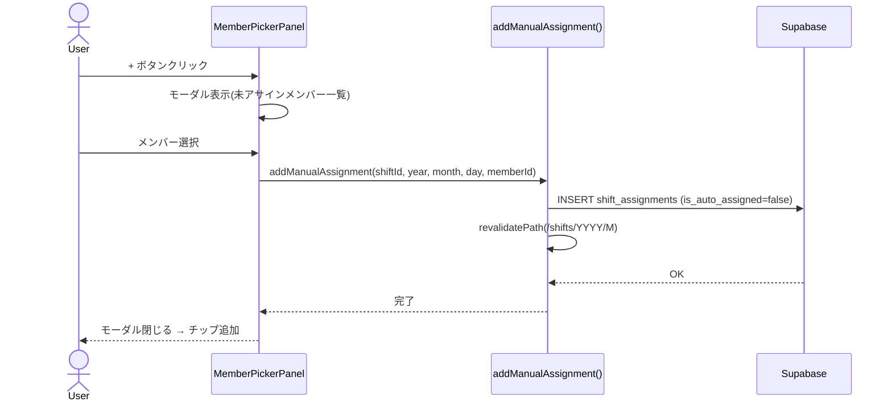

# シーケンス図

## 1. 出勤人数一括設定



## 2. シフト自動最適化

```mermaid
sequenceDiagram
    actor User
    participant UI as ShiftControls
    participant Opt as optimizeMonth()
    participant API as saveOptimizedAssignments()
    participant DB as Supabase

    User->>UI: 「自動最適化」クリック
    UI->>UI: startTransition開始
    UI->>Opt: optimizeMonth(members, days, ...)
    loop 各日(休業日除く)
        Opt->>Opt: optimizeDay(available, locked, min, day, max)
        Note over Opt: C(N,k)≤10,000 → 全探索<br/>それ以上 → Greedy
    end
    Opt-->>UI: OptimizationResult[]
    UI->>API: saveOptimizedAssignments(shiftId, year, month, results)
    API->>DB: DELETE auto-assigned records
    API->>DB: INSERT new assignments
    API->>API: revalidatePath(/shifts/YYYY/M)
    DB-->>API: OK
    API-->>UI: 完了
    UI-->>User: カレンダー再描画
```

## 3. メンバー手動アサイン


